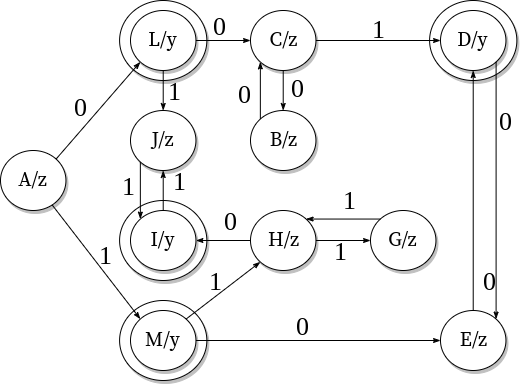

# Теория формальных языков. Лабораторная работа №2

## Программная реализация конечных автоматов

### Вариант 9

NB: **Лабораторная работа №1 по плану для студентов заочников**

#### Задание

_На известном вам языке программированя разработайте программную реализацию конечного автомата, построенного в Лабораторной работе №1._

#### Graph



#### Grammar

```ebnf
<A> ::= <L> | <M> | <I> | <D>
<L> ::= 0
<M> ::= 1
<C> ::= <L>0 | <B>0
<D> ::= <C>1 | <E>0
<J> ::= <L>1 | <I>1
<B> ::= <C>0
<I> ::= <J>1 | <H>0
<H> ::= <M>1 | <G>1
<G> ::= <H>1
<E> ::= <M>0 | <D>0
```
